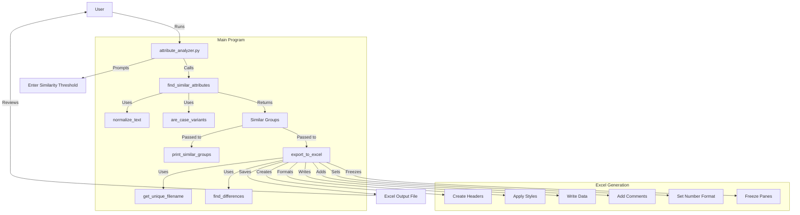

# Attribute Similarity Analyzer

A Python tool for analyzing and identifying similar product attributes in spreadsheets, designed to help standardize attribute names by detecting subtle differences in spelling, capitalization, and formatting.

## Features

- Detects similarities between attribute names using fuzzy string matching
- Identifies specific differences between attributes (case, punctuation, spacing)
- Generates detailed Excel reports with:
  - Similarity percentages
  - Highlighted differences
  - Action columns for standardization decisions
  - Automatic file versioning
- Interactive user interface for setting similarity thresholds
- Detailed difference highlighting and comments
- Excel output with frozen headers and formatted cells

## Requirements

- Python 3.10+
- Dependencies (specified in requirements.txt):
  - pandas
  - openpyxl
  - thefuzz
  - python-Levenshtein

## Installation

1. Create a virtual environment:
```bash
python3.10 -m venv venv
```

2. Activate the virtual environment:
```bash
source venv/bin/activate  # On Unix/macOS
```

3. Install dependencies:
```bash
pip install -r requirements.txt
```

## Usage

1. Place your Excel file containing attributes in the project directory
2. Run the script:
```bash
python attribute_analyzer.py
```
3. Enter the minimum similarity threshold when prompted (0-100)
4. Review the generated Excel file with the prefix "similarity_"

## Output Format

The generated Excel file contains the following columns:

1. **Pair ID**: Unique identifier for each pair of similar attributes
2. **Attribute**: The attribute names being compared
3. **Similarity %**: Percentage indicating how similar the attributes are
4. **Differences**: Explicit description of what differs between the attributes
5. **Proposed Catsy Key**: (For user input) Standardized key name
6. **Merge or Keep Separate?**: (For user input) Decision column
7. **Pair ID to merge with**: (For user input) For indicating related pairs
8. **NOTES**: (For user input) Additional comments or observations

## Architecture



## Function Descriptions

- **normalize_text**: Standardizes text for comparison by handling case, spaces, and punctuation
- **are_case_variants**: Checks if two strings differ only in capitalization
- **find_differences**: Identifies specific differences between two strings
- **find_similar_attributes**: Core function that finds similar attributes using fuzzy matching
- **print_similar_groups**: Displays results in console with formatted output
- **get_unique_filename**: Handles file naming with automatic versioning
- **export_to_excel**: Creates formatted Excel output with all findings

## Output File Naming

The script automatically handles file naming to prevent overwrites:
- First output: `similarity_[original_filename].xlsx`
- Subsequent runs: `similarity_[original_filename]_1.xlsx`, `_2.xlsx`, etc.

## Notes

- Similarity threshold is adjustable (0-100%)
- Excel comments show specific differences when hovering over cells
- Headers are frozen for easy navigation
- Alternating row colors for better readability
- Percentage formatting shows whole numbers
- Yellow-highlighted action columns for user input

## Contributing

Feel free to submit issues, fork the repository, and create pull requests for any improvements.

## License

This project is licensed under the MIT License - see the [LICENSE](LICENSE) file for details.
